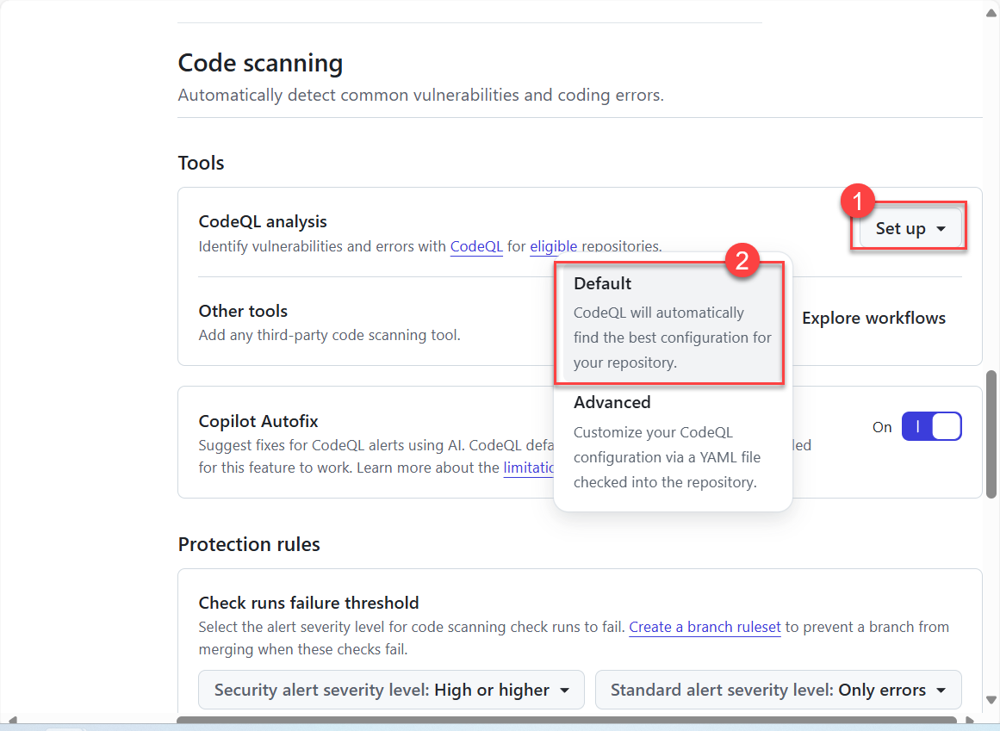
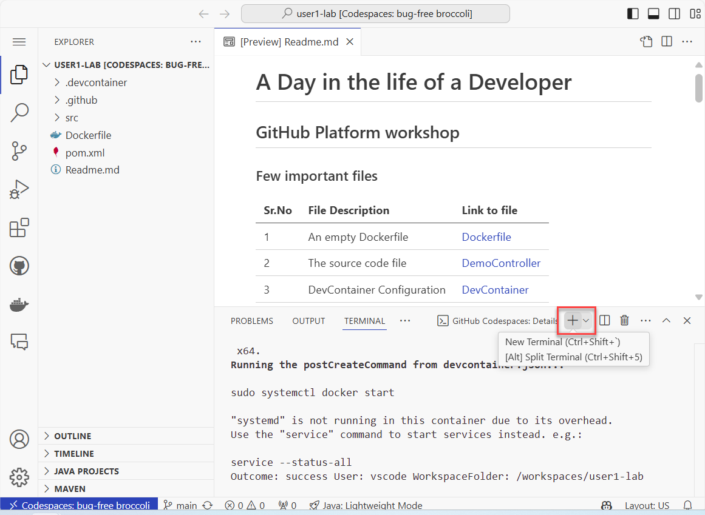
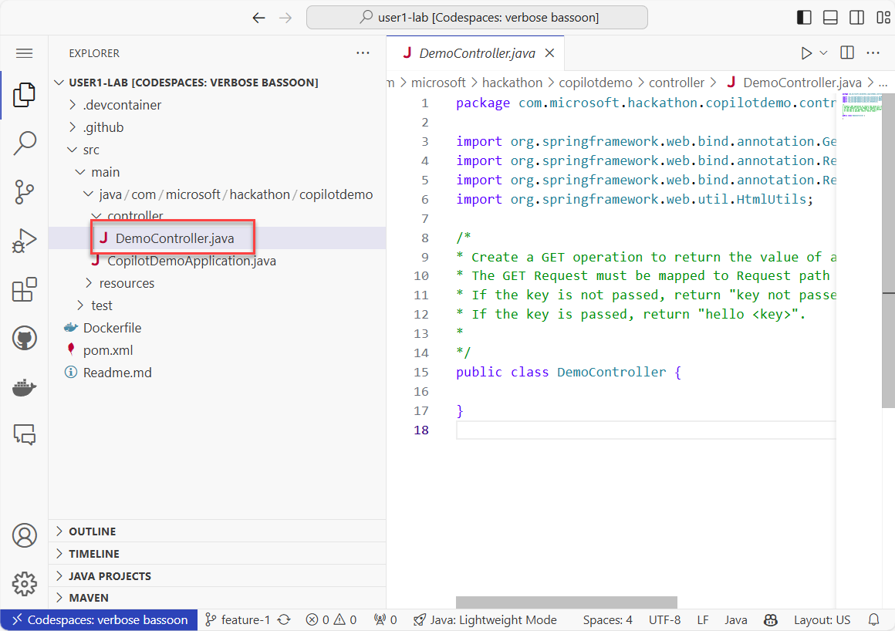

# GitHub Workshop 

## Objectives:

- Explore and Use GitHub Enterprise features

    - Code Repositories
    - Dependabot
    - GitHub Actions

- Explore and Use GitHub Advanced Security
- Use GitHub Copilot to assist in build application
- Use GitHub Codespaces as a Cloud IDE 

## Phase 0 : Creating your own copy of sample repository.

1. Login at https://github.com  with your credentials.
1. Once logged in, click on link for "copilot-demo" repository

    

1.  On next page, click on "Use this template" button, from the drop down, choose option "create a new repository".

    

1.  Enter the name for new repository. (Use your name followed by "-lab"). Also make sure the newly created repository is `Private`.

    

1.  The newly created repository has an existing `ReadMe` file.

    

## Phase 1 : GitHub Advanced Security

1.  In newly created repository, click on `Settings`.

    

1.  Under `Settings`, click on `Code Security` and then click `enable` buttons as shown below in screenshot. Scroll down for more settings.

    

1.  Enable `GitHub Advanced Security` and then `Dependabot version updates`

    

1.  As soon as you enable `Dependabot version updates`, you should be redirected to a new page wherein you must configure `package-ecosystem` for the current code repository. Make sure you enter "maven" and then use `Commit changes...` button to save the configuration in `main` branch.

    

1.  Go back to Repository Settings -> Code Security to verify `GitHub Advanced Security` configuration. Make sure `Copilot AutoFix` is enabled.

    

1.  Go to `Pull Requests` for the repository and make sure there are TWO pull requests as shown below.

    

1.  You should `Accept and Merge` both the pull requests. Click on the Pull request text/title and then use button `Merge Pull request`

    
    

    > Repeat the process for BOTH pull requests!

1.  Refresh the page and both Pull requests should disappear from the view. 

    

1.  Goto `Actions` and verify if the workflow `Dependabot Updates` has completed successfuly.

    

    > The name `Dependabot Scan` is derived from `Commit Message` auto generated by GitHub while `Merging the Pull Requests`

1.  Go back to `Code Security` (Using either `Security` or `Settings` buttons) and setup CodeQL Scanning tool (Use `Default`)

    
    

1.  You need to wait till `Initial Scan` for repository finishes.

    

    > To view progress of this action, click on `Actions` and then `CodeQL Setup`

    

## Phase 2 : Launch and Use Codespaces environment

1.  Go back to `code`, then click on `Code` button which should give option to use "Codespaces". Click on `Create codespace on main` button to launch an environment.

    

    > Setting up codespace environment might take 3 or 4 minutes.

    > You can check the progress using link `Building codespaces...` 

    

1.  Once the environment is ready, you should be able to view project source files on left side `explorer` panel. You can now use `Terminal` to build your application.

    

1.  The command to build application (which MUST fail !) would be 

    ```bash
    mvn package
    ```

    > Do not worry about `Build Failed` message as of now !
    
    

1.  Feel free to explore the source code, but DO NOT commit any changes !

1.  Close the Browser window (or tab) where codespace is running.

1.  Terminate the codespace instance for current project.

    

### Implementing a new feature in project

1. Goto `Issues` and create a new Issue.

    

1. Use following details for creating new issue

    ```yaml
    Title: Create new Simple GET Request
    Description: 
        - [ ] Create a new GIT Branch “feature-1” for the new issue
        - [ ] Use the commented text in “DemoController.java” to generate a new GET request handling method.
        - [ ] Use the pre-generated Unit Test for testing newly created REST endpoint
        - [ ] Commit the changes to “feature-1”
    ```

    

1.  Once the new Issue has been created, use link `Create a branch` to create a new branch `feature-` and also launch a new instance of `Codespace` on new branch.

    
    

1.  Wait for environment to be ready, incase of any ERROR while loading codespace, you could `rebuild` it using command `Codespaces: rebuild container`

    

    > Kindly use `rebuild container` command only if your codespace failed to launch.

1.  Now, to implement `feature-1` locate `DemoController.java` file and implement the required REST Endpoint method using copilot!

    

    

1.  Copilot chat would now present one solution, use a small button to `Apply in Editor`

    

1.  In editor, click on `Accept Changes` to accept the solution given by copilot.

    

1.  Using `Terminal` (Shortcut Key `CTRL+~` )  run following command to Run the TEST

    

    ```bash
    mvn test
    ```

1. The result of `Test` must be `Passed` or else go back to `DemoController.java` and try to re-generate code.

        
    
1.  After Test is passed, use following command to erase all generated files from `target` directory.

    ```
    mvn clean
    ```

1.  Now Commit the changes made to DemoController.java using `Commit Message` generated by Copilot.

        

        

1.  Now, sync the changes to `feature-1` remote branch.

        

1.  Use following command to locally run and test application from `Terminal`

    ```bash
    mvn spring-boot:run

    ```
        

    > The command would launch a Dev Server which would keep running unless you go back to Terminal and press `CTRL-C` to stop it.


1.  Once the new browser tab opens, try adding `/hello?key=mahendra` in URL and press ENTER to visit.

    > You may choose a different value for "key" instead of "mahendra"

        

1.  Now, you can close the Codespace browser tab and go back to your code-repository.

1.  Terminate the codespace instance as it's no longer needed.

    > GitHub Codespaces is a paid feature with hourly charges based on multiple parameters. Therefore, Close the instance to save cost.


1.  Go back to `Code` and switch to `feature-1` branch. Github should suggest creating `Pull request` to merge the changes from `feature-1` to `main` branch. Use the button to create a pull request.

        

1.  Lets create a pull request and also close the Issue created earlier with Pull request.

        

1.  Wait for 1 minute, and `GitHub Copilot Autofix` (feature of Advanced Security) should detect a `Cross site scripting` bug and also generate an explaination.

        

1.  Accept the given suggestion by `Copilot Autofix` 

        

1.  Wait for a minute and once the CodeQL Test is passed, click on button to Merge the changes in main branch.

        

1.  Go to `Issues` and check if your Issue is closed.

        

### Phase 3 : Build and Deploy container on Azure (Cloud)

1.  Lets create a new `GitHub Actions Workflow` for building container image and deploying it on Azure.
    
    Use option `Set up a workflow yourself`

        

1.  Now, copy following code snippet as workflow.

    > Kindly update the ENV section as per the comments.

    ```yaml
    name: Build

    on:
    push:
        branches: [ "main" ]
    pull_request:
        branches: [ "main" ]

    env:
        ## Kindly replace `mahendra` with your name (lowercase)
        IMAGE_NAME: ${{ secrets.ACR_URL }}/mahendra-app:latest  
        # Kindly replace mahendraapp1010 with name of your choice (No Spaces or special characters)
        DNS_LABEL: mahendraapp1010
    jobs:
      build:
        runs-on: ubuntu-latest

        steps:
        - name: Login AzureCLI
            uses: Azure/login@v2.2.0
            with:
            creds: ${{ secrets.AZURE_SECRET }}

        - name: Checkout repository
            uses: actions/checkout@v4

        - name: Docker Login
            uses: azure/docker-login@v1
            with:
            login-server: ${{ secrets.ACR_URL }}
            username: ${{ secrets.ACR_USERNAME }}
            password: ${{ secrets.ACR_PASSWORD }}

        - name: Build and Push to ACR
            uses: docker/build-push-action@v2
            with:
            push: true
            tags: ${{ env.IMAGE_NAME }}
            file: Dockerfile
                
        - name: Deploy to Azure Container Instances
            uses: Azure/aci-deploy@v1
            with:          
            resource-group: group1          
            dns-name-label: ${{ env.DNS_LABEL }}
            image: ${{ env.IMAGE_NAME }}
            name: ${{ env.DNS_LABEL }}
            location: eastus
            ports: 8080
            registry-login-server: ${{ secrets.ACR_URL }}
            registry-username: ${{ secrets.ACR_USERNAME }}
            registry-password: ${{ secrets.ACR_PASSWORD }}
    ```

1.  Commit the changes in workflow using `Commit` button.

        

1.  Once the build is completed, check the progress of build job. You should get URL for the newly deployed application on azure.

        